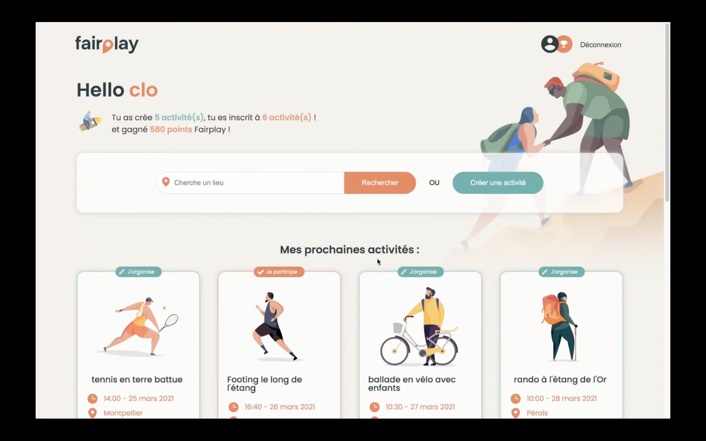
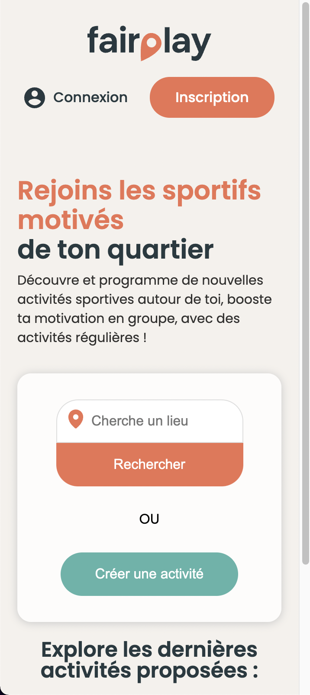
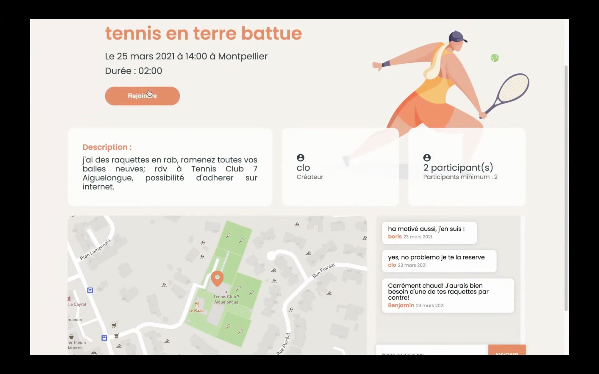
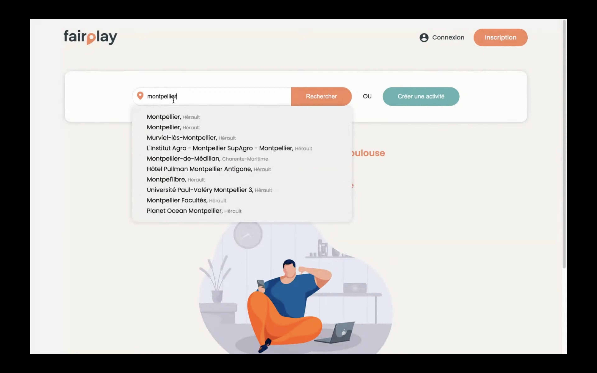
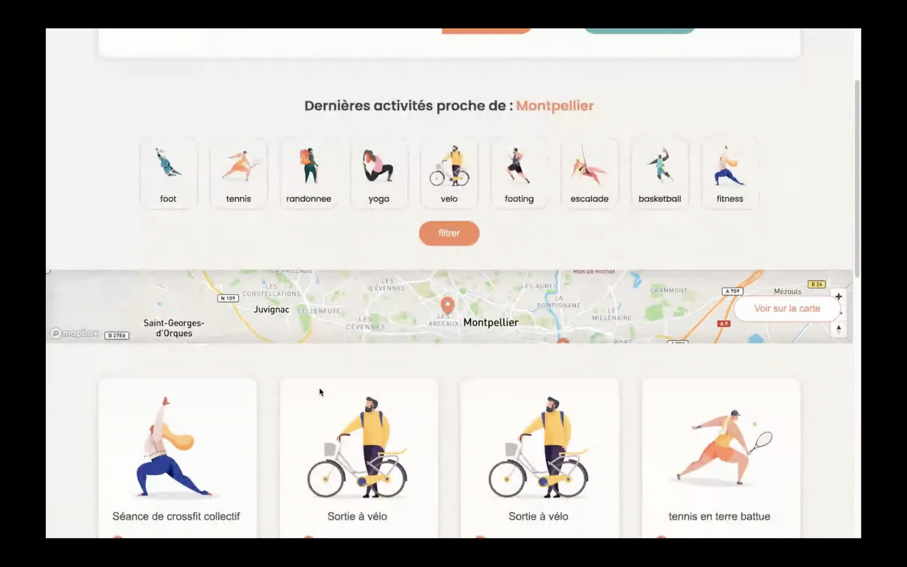

# oclock-project
Projet O'clock de fin de formation d'une durée d'un mois par groupe de 4, 2 sur le frontend et 2 sur le backend. Il s'agissait de créer un site de A à Z (de la conception au code) et de le mettre en ligne le temps de la présentation.    
Je m'occupais du frontend et j'étais également le "scrum master" du projet. Voici le petit [lien](https://youtu.be/06W8gLqBDqg?t=2338) de la présentation.   
Nous avons donc décidé de créer le site Fairplay qui met en lien des sportifs de tous les niveaux à la recherche d’une motivation et de convivialité autour d’activités sportives. Cette application web permet de faire des rencontres autour de chez soi, découvrir de nouveaux sports et s’amuser.  
 

## Les technos :
🐙 Github  
💻 VS Code  
⚙️ JS, React pour le front  
🔧 Node.js, Express, PostgreSQL pour le back  
 

## Petit aperçu du projet en image :
Page d'accueil en tant qu'utilisateur connecté, avec un système de point et d'organisation des activités :   

Responsive :  
  
 

Page d'une activité, avec la carte qui montre le lieu de l'activité ainsi que la possibilité de poster des messages :  
  
 

La recherche d'une activité :  
  
Avec la possibilité de filtrer les résultats, d'accéder à une carte interactive :  
  
 

La formulaire pour créer l'activité :  

